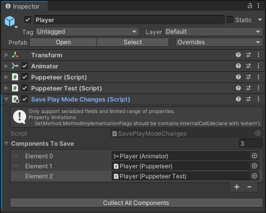

# Unity Play Mode 修改保存工具

[English](./README.md)

## 支持的Unity版本

Unity 2019.4 或更新版本。

## 如何使用

将 `SavePlayModeChanges` 组件添加到Scene中的任意GameObject上，然后将要保存PlayMode修改的其他组件拖放到 `SavePlayModeChanges` 组件的 `ComponentsToSave` 列表属性中。

进入PlayMode并修改要保存的组建的属性，然后退出PlayMode，对**受支持的**属性的修改将会被保留。

## 使用限制

仅能在Editor中使用。

仅支持 **可序列化 托管** 属性。
